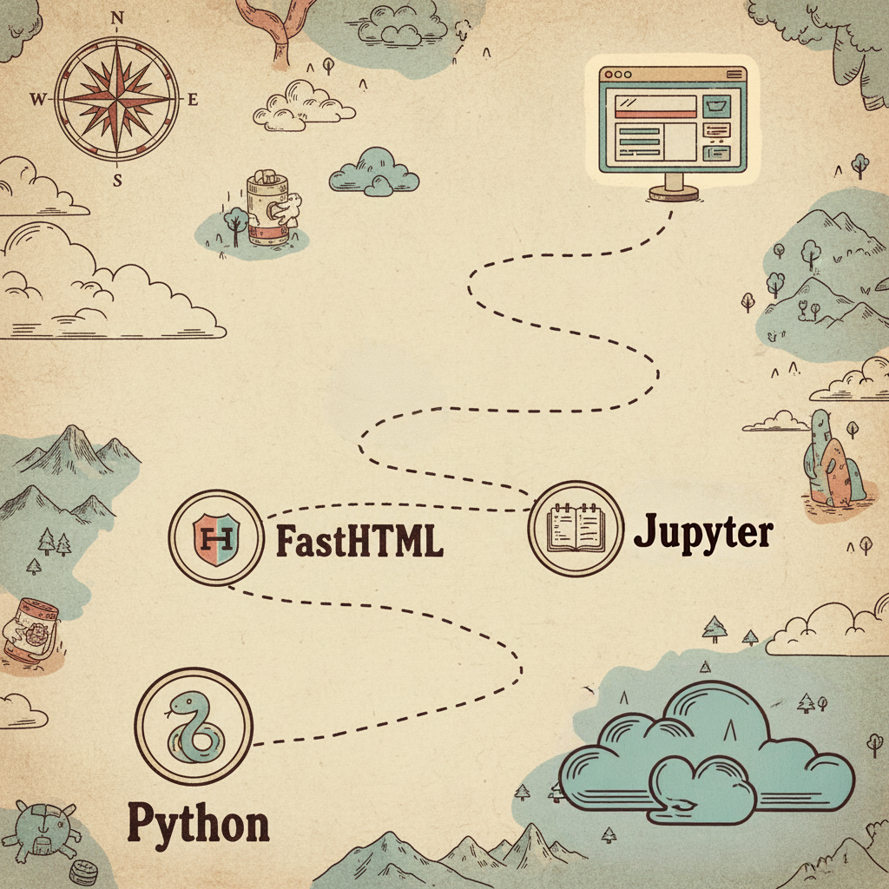

Here are my notes about how I'm learning FastHTML. Despite not having finished yet and not even having a demo worth sharing, I'm very excited that I found a coding style that makes me enjoy writing web apps, so I'm trying to share it here and also write down all the experiments that led to the final style.

::: callout-note
**Spoiler:** just like how I enjoy working in Jupyter notebooks in data science, now I think I can do almost all my web app coding in Jupyter notebooks, and I love it!
:::


I've known about FastHTML since its beginning and tried to learn it several times, but never succeeded. Either something else in life distracted me, or I just didn't have enough motivation to learn it. Recently, I had an idea about building an online store with my wife that I'm genuinely excited about (a store to sell postcards, stickers, paper things we make daily for ourselves and our daughter). So I started learning FastHTML again by literally building something for myself.

## 1st attempt: Rushing 
I started by rushing to build something that works. I know very little about web apps, so I thought learning bottom-up would take a lot of time.

I began by following [Johno's blog post](https://johnowhitaker.dev/mini-projects/silly-projects-fasthtml.html) on how he quickly builds websites. I used the AI tool Vercel V0 to create an example website for me, converted the HTML to fasttag using [h2f.answer.ai](https://h2f.answer.ai/), and then built on top of that.

*At the moment I'm writing this blog post, I realize I'm already starting to forget the details of what happened, so I'm very happy I made the decision to do it now! Otherwise, I'd forget even more and no blog post would be written.*


Then, following the `main.py` in the [notfriend repo](https://github.com/johnowhitaker/notfriend/blob/main/main.py), I created one big page object containing the whole web page including Header, Nav, Footer, and multiple Sections together. Part of it is similar to the `notfriend` Page object below:

```python
page = Div(
    Header(
        A(
            Svg(
                Path(d='M4 15s1-1 4-1 5 2 8 2 4-1 4-1V3s-1 1-4 1-5-2-8-2-4 1-4 1z'),
                Line(x1='4', x2='4', y1='22', y2='15'),
                xmlns='http://www.w3.org/2000/svg',
                width='24',
                height='24',
                viewbox='0 0 24 24',
                fill='none',
                stroke='currentColor',
                stroke_width='2',
                stroke_linecap='round',
                stroke_linejoin='round',
                cls='h-8 w-8'
            ),
            Span('NotFriend', cls='sr-only'),
            href='#',
            cls='flex items-center justify-center'
        ),
        Nav(
            A('Features', href='#features', cls='text-sm font-medium hover:underline underline-offset-4'),
            A('Testimonials', href='#testimonials', cls='text-sm font-medium hover:underline underline-offset-4'),
            A('FAQ', href='#faq', cls='text-sm font-medium hover:underline underline-offset-4'),
            cls='ml-auto flex gap-4 sm:gap-6'
        ),
        cls='px-4 lg:px-6 h-14 flex items-center justify-between'
        ...
    ),
```

Then, of course, I was overwhelmed by all this code and wasn't able to do much myself other than prompting AI to help me. The project became bigger and bigger to the point where the AI struggled to follow what I was asking. Progress was slow, I was frustrated, and obviously didn't learn much.

## 2nd iteration: AI refactors code

So I started again by reading the [official FastHTML tutorial](https://www.fastht.ml/docs/tutorials/by_example.html) to grasp generally how it works. I also read a few tutorials from [MonsterUI](https://monsterui.answer.ai/) (the UI framework for FastHTML) to understand the styling a little bit. Then I started reading the code from my project again, and this time I understood something. Based on my understanding, I asked the AI to refactor the code, there was too much long and repetitive code. By simply separating different small components, I felt much more comfortable with the code and started writing a little bit on my own (still not too much, mostly AI's code that I played with a little bit just to learn).

```python
@rt
def index(sess=None):
    return (
        nav_bar(sess),
        hero_section,
        product_cards_section(),
        newsletter_section,
        FooterSection()
    )
```

## 3rd iteration: mix notebooks and .py

At this point, the project needed to handle data, using sessions, cookies, adding more pages... The AI started making the code more complex and verbose again. I could hardly remember which data structures the AI invented. I forced it to comment more in the code with examples to remind me. And again, when the code got bigger, the AI could make errors, leading to each change taking too much time.

I thought that maybe I could tell the AI to write unit tests, so we'd be sure it wouldn't break features and they'd also be a kind of documentation for me to review when I didn't remember things.

But then, I thought maybe we're forced to use .py for things related to the webapp (actually, that's not correct :D), but anything else doesn't need to be. So let's write all the logic stuff inside Jupyter notebooks, and use `nbdev` to export them to .py files. Then in my `main.py` I can import all these necessary modules.

For example:
```python
import nbdev
nbdev.export.nb_export('./products.ipynb', '../', solo_nb=True)
```

::: callout-tip
Nowadays, for solo projects, I just use nbdev without setting up anything. Just running export with `solo_nb=True` is enough for me.
:::

Then everything became much more comfortable. I always feel most comfortable coding inside a notebook, where I can run things line by line, fully understand them, document in any way that I prefer, and test code. I'm still not very experienced with databases, so Jupyter notebooks are very handy for experimenting.

At this point, I started having control of the project, not totally dependent on the AI anymore!

## 4th iteration: all notebooks!

The good results from the previous attempt made me feel like maybe I could just do everything with `nbdev`. After all, I can export anything from a notebook to .py, even the `main.py`. Currently, I haven't finished migrating all the main code to notebooks yet. But you can run an entire FastHTML web app inside Jupyter Notebook: [Tutorial](https://www.fastht.ml/docs/tutorials/jupyter_and_fasthtml.html). With `HTMX()` I can render a FastHTML component alone, which makes it very handy to develop the UI myself (before, I always needed to ask the AI to do that for me).

::: callout-note
Only one concern right now is whether it's handy to develop the HTMX inside the notebook.
:::


Anyway, I'm happy that I'm progressing to the point where I have total control of the project and am having joy working on web apps! Thanks to Jupyter Notebook.
